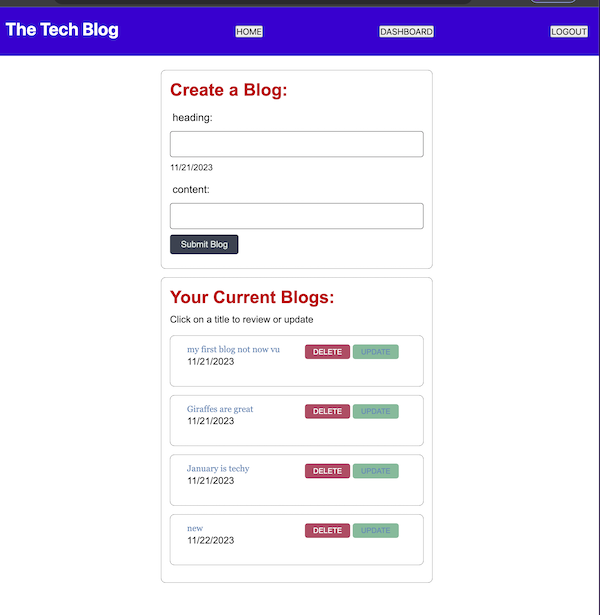

## TechBlog_MVC  

# Description
    - This was created in order to have a better understanding of Model View Controller and how it all connects.
    - In creating I have a better understanding of the paths needed from front end to back end and how it calls rendering a page
    - This system allows me to keep the storage on a server instead of keeping everything local.
    - I learned by creating the event handlers, I can create a route that will call the information from the server and show the correct page that is created by handlebars.

 This can be viewed by:  
[Click here](https://intense-eyrie-83462-fcbf99f3245c.herokuapp.com/)

## &nbsp;&nbsp;&nbsp;  Installation  
    Download github repository and open terminal, enter npm i and then nodemon server.js. Open on browser to view. Opens on home page, click on login to create an account, will then bring you to blog page to create a blog. Click on home to view blog.

## &nbsp;&nbsp;&nbsp;  Usage  
    signup account will bring you to blog page where you can enter a blog.

  

## &nbsp;&nbsp;&nbsp;  Contributing  
    Assistants of Tutor Juan Delgado and AskBCs as well as Xpert Learning Assistant.
   

# Table of Contents
- [Installation](#installation)
- [Usage](#usage)
- [License](#license)
- [Contributing](#contributing)
- [Tests](#tests)
- [Questions](#questions)

# License
The MIT License  https://opensource.org/licenses/MIT

# Questions
please contact me with any questions:  
GitHub: https://github.com/PamWillis  
Email: pwillisop@yahoo.com
